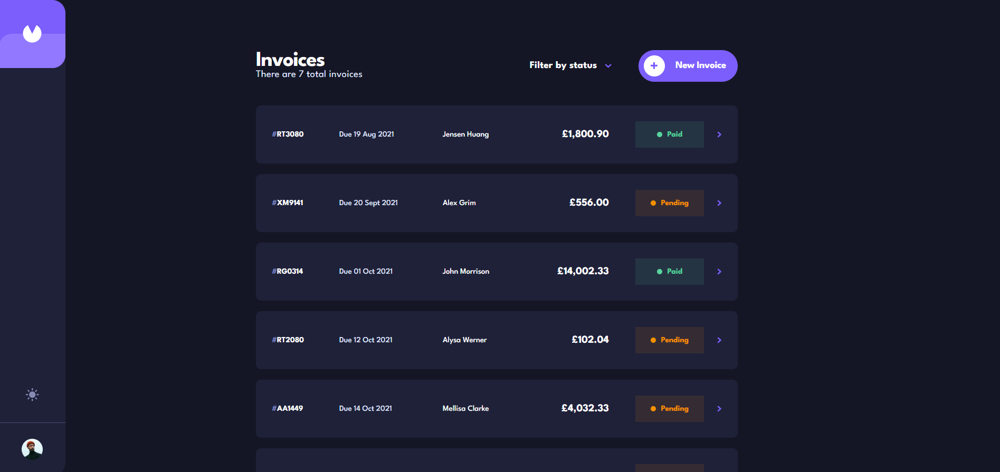

# Frontend Mentor - Invoice app solution

This is a solution to the [Invoice app challenge on Frontend Mentor](https://www.frontendmentor.io/challenges/invoice-app-i7KaLTQjl). Frontend Mentor challenges help you improve your coding skills by building realistic projects. 

## Table of contents

- [Overview](#overview)
  - [The challenge](#the-challenge)
  - [Screenshot](#screenshot)
  - [Links](#links)
- [My process](#my-process)
  - [Built with](#built-with)
  - [What I learned](#what-i-learned)
  - [Continued development](#continued-development)
  - [Useful resources](#useful-resources)
- [Author](#author)


## Overview

### The challenge

Users should be able to:

- View the optimal layout for the app depending on their device's screen size
- See hover states for all interactive elements on the page
- Create, read, update, and delete invoices
- Receive form validations when trying to create/edit an invoice
- Save draft invoices, and mark pending invoices as paid
- Filter invoices by status (draft/pending/paid)
- Toggle light and dark mode
- **Bonus**: Keep track of any changes, even after refreshing the browser

### Screenshot




### Links

(TO BE ADDED!)
- Solution URL: [Add solution URL here](https://your-solution-url.com)
- Live Site URL: [Add live site URL here](https://your-live-site-url.com)

## My process

### Built with

- HTML5
- CSS/SASS
- Flexbox
- CSS Grid
- Mobile-first workflow
- [React](https://reactjs.org) - JS library
- [React-Router](https://reactrouter.com/en/main) - Page Routing
- [Redux/Toolkit](https://redux-toolkit.js.org) - State Management
- [Vite](https://v3.vitejs.dev) - Build Tool
- [TailwindCSS](https://tailwindcss.com) - For styling
- [Node.js](https://nodejs.org/en) - Backend Javascript Enviroment
- [MongoDB](https://www.mongodb.com) - Database
- [Express](https://expressjs.com) - Framework for Node.js
- [Json Web Token](https://jwt.io) - Authorization + Authentication
- [Axios](https://axios-http.com) - Promise Based HTTP Library


### What I learned

The main focus for me on this project was to learn how to build a full stack application for the first time, so I decided to use React, Express, MongoDB & Node.js in order to do this.

One of the main things I wanted to takeaway from this project was how to host and build my own REST APIs on the backend and how to interact with them on the frontend.

I did this with the help of node & express, which I used to set up the base URL and to set the different routes/endpoints the different APIs would call to.

The different endpoints would be things like "auth" for the authentication, "users" for the sign, login & logout and "invoices" in order to interact with the invoices.

I would then use different API methods to interact with them, such as, ".get()", in order to get the data from the API, ".post()" in order to post data to the API, ".patch()" with sends data to the API but indicates we want to update some data on the backend and ".delete()" which we use to delete a piece of data on the backend.

When building the logic for the APIs on the backend, I used mongoose.js, which is a library which helps build a connection between node.js & the MongoDB database. I used this with MongoDB schemas, which mongoose provides, in order to build CRUD operations and send and retrieve the data, to and from the MongoDB database.

I used Json Web Tokens in order to create authentication, autherization and signup/login capability to the app. This works by first issuing an access token and a refresh token to the user when they initially sign in.

The access token has a short lifespan (10-15mins) and we use this to grab data from protected routes (EG- Access to a users invoices). The access token has a short lifespan for protection purposes, so no one can steal and access that users routes and it specificly has a short life span in order decrease the chances of this happening.

The refresh token has a longer lifespan (5-7 days, somes longer). We store the refresh token in a "httpOnly" cookie so it has a very low chance of someone being able to access and steal it. We use the refresh token to refresh a new access token when the access token expires, so the user can still make requests to get things, like invoices, seemlessly.

We use the refresh token to make sure the user is still signed in and we send this, along with the access token to every request the user makes to private routes. When the refresh token does expire, the user will be signed out and the user will have to sign in again in order to access the application.

To conclude, I feel I understand the overall base concept of building the backend for an application but I feel I will need some more practice by building different and interesting applications in the future before things truly begin to stick and I can remember everything and also become more familiar with the syntax. 

<br>
<br>

### Heres a small snippet showing the logic to create a new invoice, in the invoice controller file

<br>

```js
const Invoice = require("../models/Invoices");

const asyncHandler = require("express-async-handler");

// createInvoice
// post /invoices
// access: private
const createNewInvoice = asyncHandler(async (req, res) => {
  const { invoiceId, userId } = req.body;

  const newInvoiceData = { ...req.body };

  const duplicate = await Invoice.findOne({ invoiceId }).lean().exec();
  if (duplicate) {
    return res.status(409).json({ message: "Invoice already exists" });
  }

  const newInvoice = await Invoice.create(newInvoiceData);
  const allInvoices = await Invoice.find({userId}).lean();
  if (newInvoice) {
    // created
    res.status(201).json({ message: `New invoice created`, invoices: allInvoices });
  } else {
    res.status(400).json({ message: "Invalid user data received" });
  }
});

module.exports = {
  getAllInvoices,
  createNewInvoice,
  editInvoice,
  deleteInvoice,
};
```
<br>

### Heres the code I used to create the different methods going to the invoice route

(Using the "verifyJWT" here protectes all the routes below it by checking for the access token and see if it's expired or not, the user will need a access & refresh token in order to make a request to "invoice" routes.)

```js
const express = require("express");
const router = express.Router();
const invoicesController = require("../controllers/invoicesController");
const verifyJWT = require("../middleware/verifyJWT");

//Applies it to all the routes below
router.use(verifyJWT);

router.route("/:userId").get(invoicesController.getAllInvoices);

router.route("/")

  .post(invoicesController.createNewInvoice)
  .patch(invoicesController.editInvoice)
  .delete(invoicesController.deleteInvoice)


//*********//
module.exports = router;


// This is the code we used in the server.js file to connect this file to the "BASEURL/invoices" endpoint.
app.use("/invoices", require("./routes/invoicesRoute"))

```


### Continued development

In the future I look forward to using the concepts and skills I've learnt in this project to build more interesting, full stack applications. I also want to practice using the mern stack as much possible so I can fully understand the concept of setting up and building a full stack application a lot more freely.


### Useful resources

When I was learning about the mern stack I primarily used Dave Gray's youtube videos on the subject to help me understand the concept and how to implement them into my own project. If you want to check them out, I've left the links to these down below.

### Dave Grays's videos

- [MERN Stack Full Tutorial & Project](https://www.youtube.com/watch?v=CvCiNeLnZ00) - This helped me understand how to implement the main concepts into a full stack application.

- [React Login Authentication](https://www.youtube.com/watch?v=nI8PYZNFtac&list=PL0Zuz27SZ-6PRCpm9clX0WiBEMB70FWwd&index=6) - This is a video which helped me set up authentication & authorization on my project.

- [React Persistent User Login ](https://www.youtube.com/watch?v=27KeYk-5vJw&t=14s) - This video helped guide me on how to set up a persistent login for users, using Json Web Tokens.


## Author

- Website - [DJHWebdevelopment](https://www.djhwebdevelopment.com)
- Frontend Mentor - [@David-Henery4](https://www.frontendmentor.io/profile/David-Henery4)
- LinkedIn - [David Henery](https://www.linkedin.com/in/david-henery-725458241)


